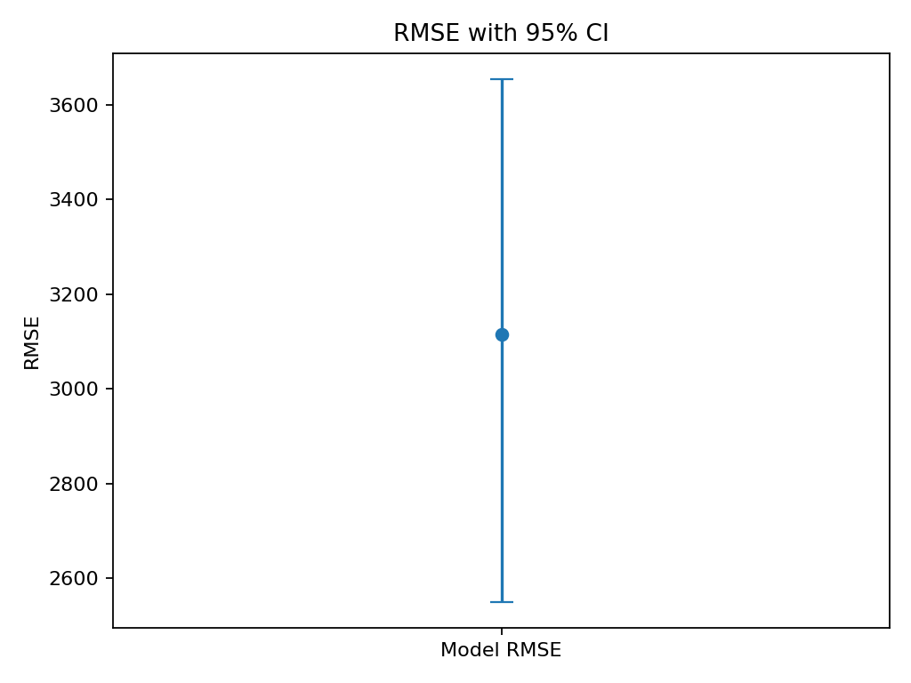
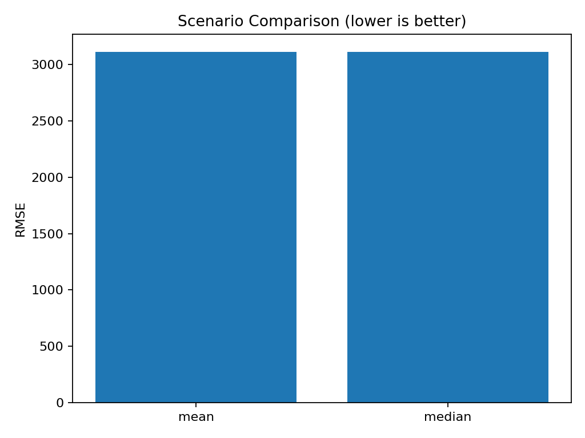
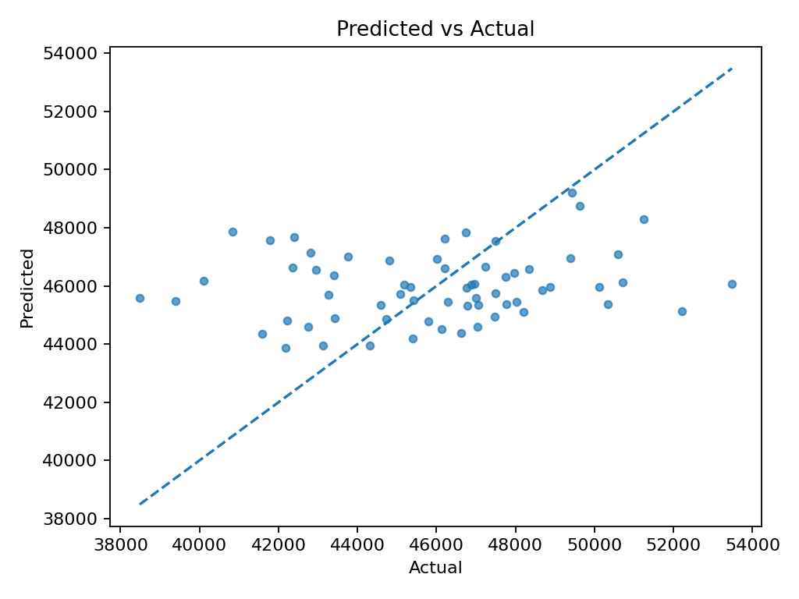
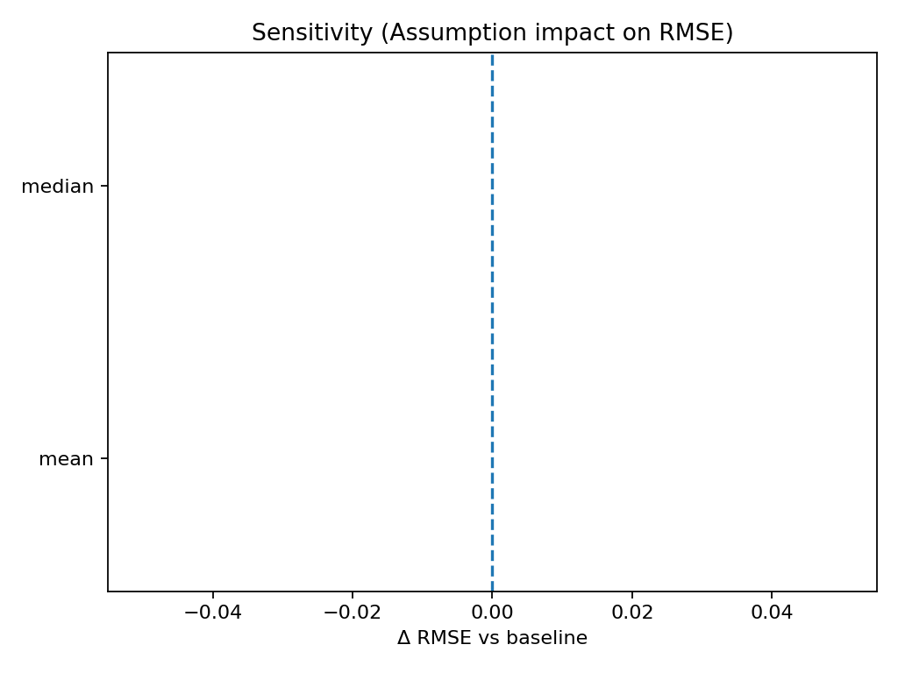

# Stage 12 — Final Results (Written Report)

## Executive Summary
- Test RMSE ≈ 3,116 (95% CI 2,551–3,653).
- Assumption sensitivity is small across tested imputers; baseline = 'median'.
- Use ranges (CIs) in decisions; avoid interpreting point forecasts as exact.

## Key Visuals (with interpretation)
**RMSE with 95% CI**  
  
*Interpretation:* Test error centers at **3,116**, uncertainty from **2,551** to **3,653**.

**Scenario Comparison (lower is better)**  
  
*Interpretation:* Baseline **median**; other scenarios shift RMSE by up to **0**.

**Predicted vs Actual**  
  
*Interpretation:* Points near the dashed line indicate better fit; dispersion shows residual noise.

## Sensitivity Summary
  
See `../artifacts/sensitivity_table.csv` for ΔRMSE vs baseline.

## Assumptions & Risks
- Data distribution similar to training; missing-rate >10% increases risk.
- Volatility spikes can widen CI; monitor over time and retrain if drift persists.

## Decision Implications
- Plan with the CI band, not a single point.
- For higher-variance segments/periods, widen guardrails or gather more data.
